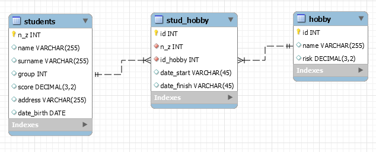

# Введение

[Учебный сервер](https://pgdb.uni-dubna.ru/)

СУБД - система управления базами данных.

Существует множество различных СУБД. Они делятся на разные модели:
Реляционная (relational), документоориентированная (document store), ключ-значение (key-value), поисковая (search engine), с широким значением столбца (wide column store), графовые (graph), временные ряды (time series).

Самые распространённые – это реляционные СУБД (РСУБД), такие как Oracle, MySQL, SQL Server, PostgreSQL.
РСУБД справляются с большинством задач, но есть и такие, где использование другой модели даст большое преимущество, например, в скорости или удобстве использования.

В этом семестре мы познакомимся только с реляционной моделью данных на примере СУБД `PostgreSQL`

# Задание 

Создать свою первую БД в соответствии со схемой ниже. Наполнить БД данными.

