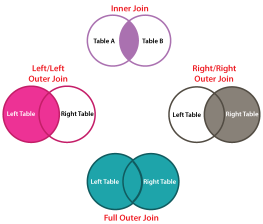
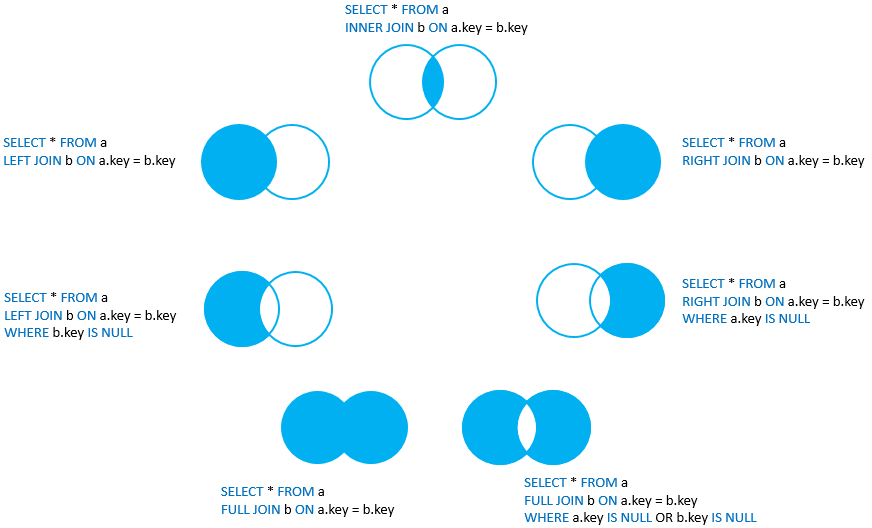

# Задание

Написать запросы:

1. Выведите номера групп и количество студентов, обучающихся в них
2. Выведите для каждой группы средний балл
3. Подсчитать количество студентов с каждой фамилией, вывести на экран только те фамилии, которые встречаются несколько раз. Отсортировать по количеству повторений фамилии.
4. Подсчитать студентов, которые родились в каждом году. Отсортировать по возрастанию года рождения
5. Для студентов каждого курса подсчитать средний балл
6. Для студентов заданного курса вывести группу с максимальным средним баллом
7. Для каждой группы подсчитать средний балл, вывести на экран только те номера групп и их средний балл, в которых он менее или равен 3.5. Отсортировать от меньшего среднего балла к большему.
8. Вывести студента/ов, который/ые имеют наибольший балл в заданной группе
9. Вывести для каждой группы студента с максимальным баллом.
10. Вывести для каждой группы студента с наибольшим числом активных хобби

# Агрегатные функци

1.  [COUNT](#COUNT)
2.  [SUM](#SUM)
3.  [MIN](#MIN)
4.  [MAX](#MAX)
5.  [AVG](#AVG)

В большинстве современных СУБД есть возможность использовать так называемые групповые функции (group functions), позволяющие анализировать сразу группы записей.
Под группой записей понимается любой набор записей, имеющих что-то общее – например, записи, относящиеся к одному товару, одному отделу или одному временному интервалу.
В операторе SELECT при помощи параметра GROUP BY можно определить состав групп, после чего при помощи групповых функций подсчитать количество записей, вошедших в группу, подсчитать итоговую сумму, а также минимальное, максимальное или среднее значение для каждой группы.
Если параметр GROUP BY в запросе не указан, то группой записей считается все строки интересующей таблицы.

##### COUNT

Функция возвращает количество записей в группе. Возможно три варианта использования функции COUNT:

COUNT(\*) – подсчет количества записей в группе;

COUNT(поле) – подсчет количества отличных от NULL значений в указанном поле записей группы;

COUNT(DISTINCT поле) – подсчет количества уникальных отличных от NULL значений в указанном поле записей группы.

Примеры использования функции COUNT:

-- подсчет количества строк в таблице student

```sql
SELECT COUNT(*)
FROM student s;
```

-- подсчет количества всех различных фамилий студентов

```sql
SELECT COUNT(DISTINCT L_name)
FROM student;
```

##### SUM

Функция SUM возвращает суммарное значение для группы.

-- подсчет суммарного значения риска

```sql
SELECT SUM(risk)
FROM hobby;
```

##### MAX

Функция MAX возвращает максимальное значение для группы.

-- подсчет максимальной даты рождения среди студентов, т. е. поиск самого молодого студента

```sql
SELECT MAX(date_birth)
FROM student;
```

##### MIN

Функция MIN возвращает минимальное значение для группы.

поиск самого “старого” студента

```sql
SELECT MIN(date_birth)
FROM student;
```

##### AVG

Функция AVG возвращает среднее значение для группы.

-- подсчет средней степени риска для хобби, названия которых заканчиваются на «ов»

```sql
SELECT AVG(risk)
FROM hobby
WHERE name LIKE '%ов';
```

#### Использование параметров GROUP BY и HAVING

В предыдущих примерах в качестве группы рассматривался весь набор записей, полученный в результате выполнения запроса. При помощи параметра GROUP BY оператора SELECT можно указать способ разбиения полученного в результате выполнения запроса набора записей на группы. В параметре GROUP BY задается столбец (или столбцы), по значениям которого будет производиться группировка. При выполнении оператора SELECT, в котором присутствует параметр GROUP BY, СУБД проанализирует значение указанного столбца во всех строках, отобранных в результате выполнения запроса. Все строки, где значение указанного в параметре GROUP BY столбца одно и тоже, попадут в одну группу. После этого для каждой из групп будет вычислена указанная в параметре SELECT групповая функция. Например:

-- вывод номеров групп и количества студентов в каждой группе

```sql
SELECT n_group,
       COUNT(n_group) AS stud_count
FROM student
GROUP BY n_group
ORDER BY n_group DESC;
```

В данном запросе СУБД сначала выделит группы записей, относящиеся к разным группам (в зависимости от значения столбца n_group) и для каждой получившейся группы посчитает количество записей.

Будьте внимательны, по сути в `GROUP BY` должны быть записаны все атрибуты, которые присутствуют в `SELECT`. Наоборот - не обязательно. Тот же запрос, написанный выше может быть выполнен и таким образом:

```sql
SELECT COUNT(n_group) AS stud_count
FROM student
GROUP BY n_group;
```

Он выполнится точно также, как и предыдущий, однако выдаст на экран только количества студентов, без номера группы.

Параметр HAVING оператора SELECT используется для исключения групп из результирующего набора записей на основе результатов выполнения групповых функций. После параметра HAVING также как и после параметра WHERE указывается условие фильтрации, но в отличие от параметра WHERE, условия которого используются для фильтрации отдельных строк, условия, указанные в параметре HAVING используются для фильтрации целых групп. Например:

-- отбор групп, в которых количество студентов более 12.

```sql
SELECT n_group,
       COUNT(n_group) AS stud_count
FROM student
GROUP BY n_group
HAVING COUNT(n_group) > 12;
```

Т.е. мы используем `WHERE` для создания условия на выбираемые из таблицы данные. А `HAVING` используем для отбора получаемых в результате выполнения функции агрегирования.

Аналогичный запрос сверху, с использованием `HAVING` можно переписать с использованием `WHERE` таким образом:

```sql
SELECT *
FROM
  (SELECT n_group,
          COUNT(n_group) AS stud_count
   FROM student
   GROUP BY n_group) t
WHERE stud_count > 12;
```


# Запросы с использованием нескольких таблиц

##### Декартово произведение таблиц


Соединения – это подмножества декартова произведения. Так как декартово произведение N таблиц – это таблица, содержащая все возможные строки R, такие, что R является сцеплением какой-либо строки из первой таблицы, строки из второй таблицы, ... и строки из N-й таблицы, то осталось лишь выяснить, можно ли с помощью SELECT получить декартово произведение. Для получения декартова произведения нескольких таблиц надо указать в параметре FROM перечень перемножаемых таблиц, а во фразе SELECT – все их столбцы.

Так, для получения декартова произведения таблиц student и student_hobby, необходимо выполнить запрос:

```sql
SELECT student.*,
       student_hobby.*
FROM student,
     student_hobby;
```

В зависимости от количества строк, содержащихся в обеих таблицах, результирующий набор записей будет содержать количество строк, равно N\*M, где N – количество строк в таблице student, а M – количество строк в таблице student_hobby. При выполнении декартово произведения над большим количеством таблиц, количество получившихся строк еще более возрастет. Если взять любой из результатов, полученных после выполнения декартово произведения, то станет понятно, что актуальными записями являются лишь очень немногие. Поэтому операция декартово произведения является лишь промежуточным этапом.

Актуальные строки можно отобрать из декартового произведения путем ввода в запрос параметра WHERE, в котором устанавливается соответствие между полями, посредством которых каждая пара таблиц связана между собой.

```sql
SELECT student.*,
       student_hobby.*
FROM student,
     student_hobby
WHERE student.id= student_hobby.student_id;
```


##### Соединение таблицы со своей копией

В ряде приложений возникает необходимость одновременной обработки данных какой-либо таблицы и одной или нескольких ее копий, создаваемых на время выполнения запроса.
Данная возможность часто используется для выявления объектов, имеющие общие значения атрибутов и находящиеся в одной таблице. В последнем случае в параметре WHERE устанавливают равенство значений всех одноименных столбцов этих таблиц, по значениям которых необходимо выявить совпадения, а для остальных установить неравенство значений (обычно достаточно установить неравенство значений полей, входящих в состав первичного ключа).
Временную копию таблицы можно сформировать, указав имя псевдонима за именем таблицы во фразе FROM.

Пример соединения таблиц со своей копией:

-- получение списка однофамильцев

```sql
SELECT s1.*
FROM student s1,
     student s2
WHERE s1.surname=s2.surname
  AND

#### Внутреннее и внешнее объединение таблиц




Кроме этого во многих СУБД существуют реализации операции внутреннего и внешнего условных соединений таблиц внутри одного запроса – INNER JOIN (внутреннее объединение), LEFT JOIN (полное левое объединение), RIGHT JOIN (полное правое объединение), OUTER JOIN (полное внешнее объединение).

Синтаксис применения операция объединения выглядит следующим образом:

```sql
SELECT _список_полей_
FROM _таблица1_ (INNER | LEFT | RIGHT | OUTER)
JOIN _таблица2_ ON _таблица1.связующее_поле = таблица2.связующее_поле_;
```
В результате выполнения внутреннего объединения из кортежей двух объединяемых таблиц остаются только те, для которых выполняется указанное условие.

При полном (внешнем) левом объединении из кортежей двух объединяемых таблиц остаются все кортежи таблицы, указанной слева от условного выражения, и кортежи правой таблицы, для которых выполняется указанное условие.

При полном (внешнем) правом объединении из кортежей двух объединяемых таблиц остаются все кортежи таблицы, указанной справа от условного выражения, и кортежи левой таблицы, для которых выполняется указанное условие.

Более подробно на различных.

1. Если таблицы не соединяются никак, то будут выведены все возможные варианты. Перемножено количество записей одной таблицы, на количество записей в другой. Такое практически никогда не бывает полезно.

2. `INNER JOIN`. В таком случае на экран будут выведены те данные, которые присутствуют в обоих таблицах.


```sql
Select s.*
FROM student s
INNER JOIN student_hobby sh on s.id = sh.student_id;
```

или

```sql
Select student.*
FROM student s, student_hobby sh
WHERE s.id = sh.student_id;
```

3. `LEFT JOIN` выведет на экран все данные, которые есть на пересечении таблиц, а также все данные из таблицы, находящейся слева, которые не попали в пересечение.

```sql
Select s.*, sh.*
FROM student s
LEFT JOIN student_hobby sh on s.id = sh.student_id;
```


4. `RIGHT JOIN` аналогичен левому. Только в результат попадут данные из таблицы справа

```sql
Select s.*, sh.*
FROM student s
RIGHT JOIN student_hobby sh on s.id = sh.student_id;
```


5. `FULL OUTER JOIN` выводит в результате всё, что было на пересечении двух таблиц, а также данные из левой и из правой, которые не попали в пересечение.

```sql
Select s.*, sh.*
FROM student s
FULL OUTER JOIN student_hobby sh on s.id = sh.student_id;
```


