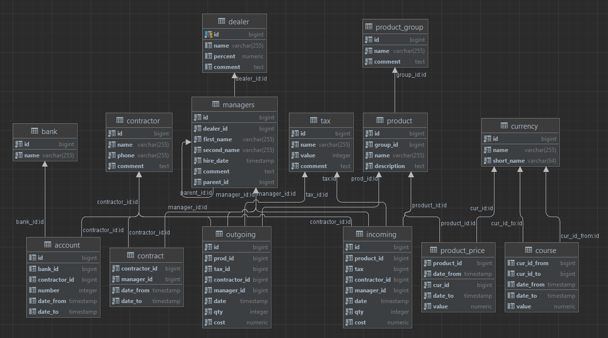

## Задание

Заполнить БД, скрипт для создания лежит в файле `script.sql`

Минимальные требования к наполнению

1. 6 менеджеров
2. 4 групп продуктов
3. 10 продуктов
4. 2 банка
5. 4 дилера
6. 4 контрагентов
7. 3 валюты
8. 2 налога
9. 20 продаж
10. 15 закупок
11. Несколько продуктов должны иметь разную цену при одном и том же значении id_продукта
12. Несколько менеджеров должны иметь подчиненных
13. Для каждого соотношения валют должны быть определены несколько значений в различных временных рамках.

